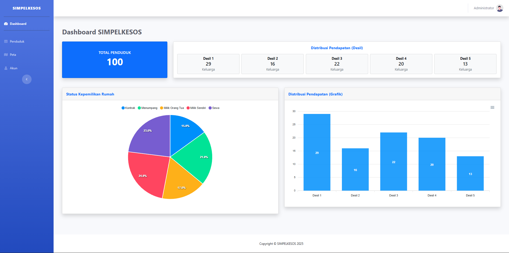
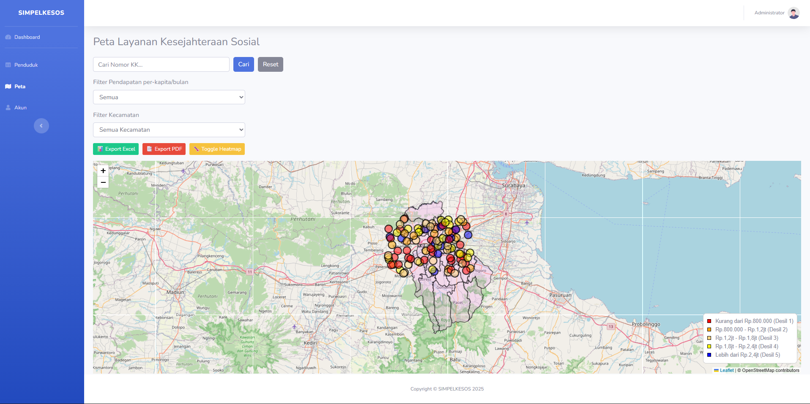

# 🏡 SIMPELKESOS

Aplikasi **Sistem Informasi Pemetaan Layanan Kesejahteraan Sosial (SIMPELKESOS)** berbasis web.  
Dibangun menggunakan **Laravel 12**, aplikasi ini membantu perangkat desa dalam:  
- Pendataan penduduk  
- Pemetaan kondisi sosial ekonomi  
- Analisis kesejahteraan berbasis desil pendapatan  
- Visualisasi peta menggunakan **Leaflet.js**  

---

## 🚀 Fitur Utama
- **Autentikasi Pengguna**
  - Login & Logout
  - Pengelolaan akun (edit profil & ubah password)

- **Manajemen Penduduk**
  - Tambah, edit, hapus data penduduk
  - Upload foto rumah, foto dalam, dan foto kamar mandi
  - Import data dari file **Excel/CSV**
  - Export detail data penduduk ke **PDF**
  - Tambah dan kelola anggota keluarga

- **Dashboard**
  - Statistik jumlah penduduk
  - Distribusi pendapatan per desil
  - Status kepemilikan rumah (milik sendiri, kontrak, menumpang)

- **Peta Desa (Leaflet.js)**
  - Visualisasi lokasi rumah berdasarkan koordinat
  - Filter berdasarkan kategori pendapatan (desil)
  - Cari penduduk berdasarkan nomor KK
  - Marker interaktif dengan detail penduduk

- **Akun Pengguna**
  - Lihat informasi akun
  - Update profil
  - Ubah password

---

## 📷 Screenshots

### Dashboard


### Data Penduduk


### Peta Desa


### Akun Pengguna


---

## 🛠️ Teknologi yang Digunakan
- [Laravel 12](https://laravel.com/)
- [MySQL](https://www.mysql.com/) / MariaDB
- [Bootstrap 5](https://getbootstrap.com/)
- [Leaflet.js](https://leafletjs.com/) (peta interaktif)
- [SweetAlert2](https://sweetalert2.github.io/) (alert interaktif)
- [Maatwebsite Excel](https://docs.laravel-excel.com/) (import data)
- [Barryvdh DomPDF](https://github.com/barryvdh/laravel-dompdf) (export PDF)

---


## 📦 Instalasi & Setup

1. **Clone Repository**
   ```bash
   git clone https://github.com/username/simpelkesos.git
   cd simpelkesos
2. **Install Dependency**
   ```bash
   composer install
   npm install && npm run dev
3. **Setup Environment**
   ```bash
   cp .env.example .env
   DB_DATABASE=simpelkesos
   DB_USERNAME=root
   DB_PASSWORD=
4. **Generate Key**
   ```bash
   php artisan key:generate
5. **Migrasi Database**
   ```bash
   php artisan migrate --seed
   ```
   Akun program :
   Email    : admin@desa.com
   Password : password123
6. **Jalankan Server**
   ```bash
   php artisan serve
   ```
   Akses aplikasi di -> http://127.0.0.1:8000


